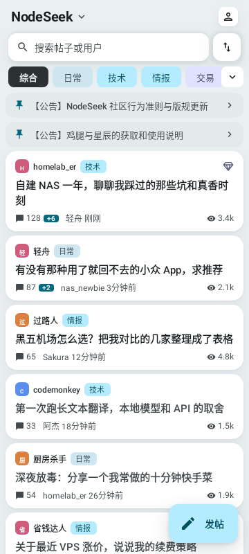
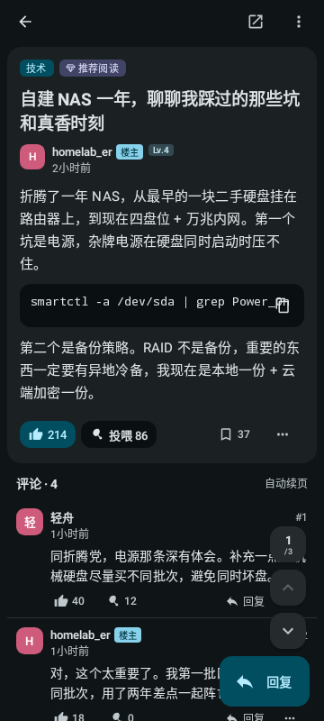
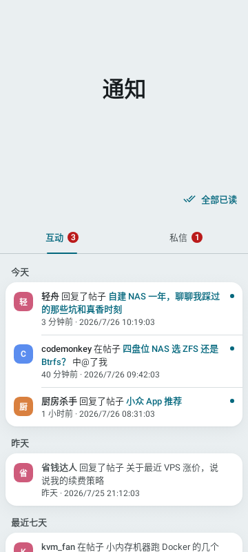
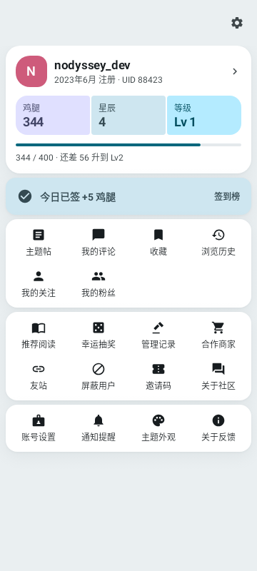

<div align="center">

# Nodyssey

[NodeSeek](https://www.nodeseek.com/) 的非官方开源 Android 客户端，Kotlin + Jetpack Compose，帖子渲染为原生 Compose 内容。

[](https://github.com/5151561/nodyssey/releases)
[](https://github.com/5151561/nodyssey/releases)
[](https://github.com/5151561/nodyssey/stargazers)
[](https://github.com/5151561/nodyssey/actions/workflows/ci.yml)
[](LICENSE)

[](https://github.com/5151561/nodyssey/releases)
[](https://kotlinlang.org/)
[](https://developer.android.com/compose)

[](https://5151561.github.io/nodyssey/)
[](https://t.me/nodyssey_official)
[](https://t.me/+97ANIwVaCYk1MjQ1)






</div>

## 下载

到 [Releases](https://github.com/5151561/nodyssey/releases) 下载最新 APK，应用内也可以检查更新。各版本变化见 [CHANGELOG.md](CHANGELOG.md)。

## 功能

- **浏览与互动**：发帖、评论、编辑；点赞 / 反对 / 投喂鸡腿、收藏、签到；投票帖阅读与投票
- **消息与社交**：通知与未读数、私信、关注 / 粉丝、用户空间
- **账号**：鸡腿与星辰流水、星辰转账与收款码、等级进度、账号设置
- **阅读体验**：离线缓存、已读标记、浏览历史与阅读位置、图片预览 / 保存 / 分享、六种图床上传
- **界面**：Material 3 Expressive，宽屏自动换侧边栏；简体 / 繁體 / English 三语

## 构建

需要 JDK 21 和 Android SDK 37。

```bash
./gradlew :app:assembleDebug
```

模块划分和架构约定见 [docs/architecture.md](docs/architecture.md) 与 [docs/README.md](docs/README.md)。

## 参与

- 反馈问题：[Issues](https://github.com/5151561/nodyssey/issues/new/choose)，请带上 App 版本、机型和 Android 版本
- 用法提问：[Telegram 群组](https://t.me/+97ANIwVaCYk1MjQ1)
- 提 PR 前请先读 [CONTRIBUTING.md](CONTRIBUTING.md)

## 致谢

- [tyrad/nodeseek](https://github.com/tyrad/nodeseek)（iOS 客户端，MIT）—— 站点结构的逆向参考
- [mrzhiin/seekmate](https://github.com/mrzhiin/seekmate)（React Native 客户端，MIT）—— 部分 JSON 端点的发现来源

本项目独立实现，不共享代码。

## 说明

本项目与 NodeSeek 官方无关，是社区自制客户端。请求频率保持克制，不做自动化刷分；仓库中不保存任何 Cookie 或凭据。

## 许可

[GPL-3.0](LICENSE)
